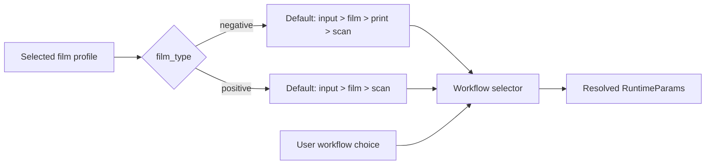
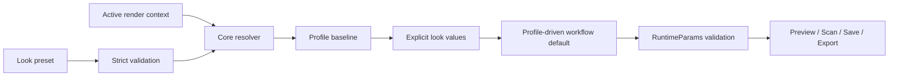

# Look presets

## Contract

A **look preset** is a named, reusable combination of film and print profile selections and visual simulation controls. A look preset is not a complete GUI state, an input image, a viewer state, an export configuration, a LUT, a calibration profile, or a workflow selection.

The GUI provides a Presets browser beside the film and print profile controls. The first implementation exposes five immutable Built-in rows with name, film profile, print profile, and Apply. User library views and management operations remain specified for the follow-on library boundary; they must not be implemented by reusing complete `GuiState`.

### Apply

- Selecting a preset validates the complete preset before changing active controls.
- A preset identifies both film and print profiles. The resolver validates film=`support=film, stage=filming` and print=`support=paper, stage=printing`.
- A preset does not store or directly apply a workflow. Changing film profile selects the corresponding workflow default: negative film selects `input > film > print > scan`, and positive film selects `input > film > scan`. The user may then choose another supported workflow manually.
- Applying a preset replaces all look-owned controls together, clears transient Scan-for-print state, invalidates dependent render state, and schedules a render according to Auto preview.
- Applying a preset preserves loaded image and metadata, RAW/source settings, source exposure, crop, resize, rotation, viewer/display state, Save settings, and Export settings.
- Built-in presets are immutable. Editing controls after an apply never rewrites the built-in definition.

### Workflow defaulting

Changing a film profile selects the corresponding workflow default while the workflow remains user-editable:

A profile change must not apply hidden stock-specific look values. The workflow selector remains editable until the next film profile change. The positive path does not execute print stages; its explicit print profile remains part of the portable pair.

A serialized `route` or `workflow` field is unknown and rejected.

### Look ownership

A look preset owns film and print selection plus explicit film, print, enlarger, diffusion, halation, coupler, grain, glare, base, chemistry, and scanner look controls. It preserves enabled states and f64 values. It does not own workflow, image/input, RAW/source correction, geometry, viewer/display, output encoding, export destination, preview limits, cache, debug/taps, startup state, dialog directories, or random seed.

### Implementation rules

- `core` owns the typed look model, strict schema validation, profile compatibility, profile-driven workflow defaulting, capture, and candidate resolution.
- `gui` owns browser presentation, immutable built-in selection, transient state, and user-editable workflow controls.
- `GuiState` remains complete GUI-state persistence and is not a look payload.
- `core` owns strict parsing, profile resolution, stock-baseline construction, explicit look-value overlay, workflow-default derivation, and `RuntimeParams` validation. Explicit preset neutral filters must survive subsequent runtime preparation without changing the user's database-calibration setting.
- Existing `--params` invocations, `RenderRecipe`, LUT behavior, CPU f64 semantics, WGPU f32 semantics, Grain V2 algorithm, Python parity, and raw profile assets must remain unchanged. The [CLI parameter language](../cli-parameters/spec.md) owns new command syntax and composition rules.

The portable canonical snake-case schema contains:

- `schema_version`, `id`, `name`, optional `author` and `description`;
- `film_profile` and `print_profile`, each with stock, optional profile version, and optional `sha256-<lowercase-hex>` content identity;

- `parameters`, the typed look-owned parameter object;
- `provenance`, the SpektraFilm implementation and model versions.

It must not contain `route`, `workflow`, image pixels/paths, RAW data, LUT pixels, viewer rasters, GUI paths, credentials, random seeds, or Dehancer-specific fields. Unknown fields are rejected. The resolved candidate is returned without mutating active GUI state; GUI commits only after successful resolution.

### File formats

TOML must be the default preset export format. Readers must accept `.toml` and `.json` files as carriers of the same typed schema. The file extension must select the parser. A reader must not try another parser after a parse failure. Both carriers must apply the same version, ownership, profile, type, and value validation.

A preset must contain every look-owned group. An exporter must write every non-optional editable look control so a newly exported preset does not depend on implicit defaults. Schema version 1 readers must retain the existing omitted-field and JSON null decoding rules of the typed model. Readers must materialize omitted controls before resolution or re-export. TOML absence must represent an unset optional control; an exporter must omit unset optional controls in TOML. The format change must not introduce a separate schema version or field vocabulary. A future change to accepted omitted-field behavior must use an explicit schema migration rather than silently rejecting existing version 1 documents.

Export and reload must preserve the represented finite f32 and f64 values. Export must not reduce numeric precision for shorter text. Readers must accept TOML comments. Re-export need not preserve comments or source formatting.

Readers must reject non-finite numeric controls and numeric values that overflow their declared f32 or f64 type. TOML `nan`, `inf`, date/time values, and numbers that become non-finite during typed conversion must not reach the resolver. Readers must not convert unsupported carrier types to strings. This rule must apply before runtime validation so JSON and TOML cannot admit different numeric domains.

Preset files must not support includes, inheritance, expressions, environment interpolation, or references to GUI state files.

### GUI state compatibility

GUI state must retain its JSON contract. Loading a GUI state must not interpret it as a look preset. Importing a preset must not interpret it as a complete GUI state.

Saving state after applying or editing a preset must store the actual controls and the calibration policy needed to restore them. Restoring that state must preserve explicit neutral filters through runtime preparation. The saved state must not depend on the preset file or built-in definition remaining available or unchanged. Any new Rust-owned state metadata must use the existing versioned Rust extension and must preserve existing Python state normalization.

Capturing a preset from the GUI must use the active look controls. Applying it must preserve the excluded context defined in [Look ownership](#look-ownership).

### Resolution flow

The preset and active render context are separate inputs to the same runtime:

The resolver must preserve image/source, geometry, viewer, display, Save, Export,
debug, precision, backend, and random-seed context. The GUI commits the returned
candidate only after resolution succeeds.

### Transaction and stale results

Applying a preset validates and resolves first, commits film/print/look parameters together, selects the profile-derived workflow default, preserves excluded context, clears transient Scan-for-print, increments a parameter revision, invalidates caches, and marks the render dirty. Render workers carry the parameter revision and stale results cannot replace a newer preset result.

CLI preset selection must use the same core resolver as GUI preset application. The [CLI parameter language](../cli-parameters/spec.md) defines selection, sparse parameter files, and command compatibility.
