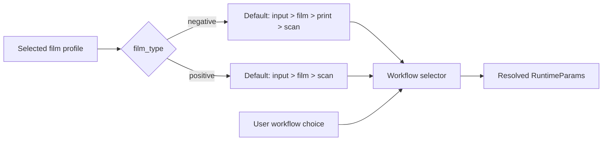
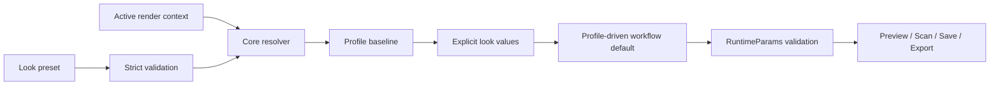

# Look presets

## Contract

A **look preset** is a named, reusable combination of film and print profile selections and visual simulation controls. A look preset is not a complete GUI state, an input image, a viewer state, an export configuration, a LUT, a calibration profile, or a workflow selection.

The GUI provides a Presets browser beside the film and print profile controls. The first implementation exposes five immutable Built-in rows with name, film profile, print profile, and Apply. User library views and management operations remain specified for the follow-on library boundary; they must not be implemented by reusing complete `GuiState`.

### Apply

- Selecting a preset validates the complete preset before changing active controls.
- A preset identifies both film and print profiles. The resolver validates film=`support=film, stage=filming` and print=`support=paper, stage=printing`.
- A preset does not store or directly apply a workflow. Changing film profile selects the corresponding workflow default: negative film selects `input > film > print > scan`, and positive film selects `input > film > scan`. The user may then choose another supported workflow manually.
- Applying a preset replaces all look-owned controls together, clears transient Scan-for-print state, invalidates dependent render state, and schedules a render according to Auto preview.
- Applying a preset preserves loaded image and metadata, RAW/source settings, source exposure, crop, resize, rotation, viewer/display state, Save settings, and Export settings.
- Built-in presets are immutable. Editing controls after an apply never rewrites the built-in definition.

### Workflow defaulting

Changing a film profile selects the corresponding workflow default while the workflow remains user-editable:

A profile change must not apply hidden stock-specific look values. The workflow selector remains editable until the next film profile change. The positive path does not execute print stages; its explicit print profile remains part of the portable pair.

A serialized `route` or `workflow` field is unknown and rejected.

### Look ownership

A look preset owns film and print selection plus explicit film, print, enlarger, diffusion, halation, coupler, grain, glare, base, chemistry, and scanner look controls. It preserves enabled states and f64 values. It does not own workflow, image/input, RAW/source correction, geometry, viewer/display, output encoding, export destination, preview limits, cache, debug/taps, startup state, dialog directories, or random seed.

### Implementation rules

- `core` owns the typed look model, strict schema validation, profile compatibility, profile-driven workflow defaulting, capture, and candidate resolution.
- `gui` owns browser presentation, immutable built-in selection, transient state, and user-editable workflow controls.
- `GuiState` remains complete GUI-state persistence and is not a look payload.
- The resolver parses strictly, resolves and validates both profiles, builds the stock baseline, overlays explicit look values, pins explicit neutral filters, derives the workflow default, and validates `RuntimeParams` before returning a candidate.
- Existing `--params`, `RenderRecipe`, CLI behavior, LUT behavior, CPU f64 semantics, WGPU f32 semantics, Grain V2 algorithm, Python parity, and raw profile assets remain unchanged.

The portable canonical snake-case schema contains:

- `schema_version`, `id`, `name`, optional `author` and `description`;
- `film_profile` and `print_profile`, each with stock, optional profile version, and optional `sha256-<lowercase-hex>` content identity;

- `parameters`, the typed look-owned parameter object;
- `provenance`, the SpektraFilm implementation and model versions.

It must not contain `route`, `workflow`, image pixels/paths, RAW data, LUT pixels, viewer rasters, GUI paths, credentials, random seeds, or Dehancer-specific fields. Unknown fields are rejected. The resolved candidate is returned without mutating active GUI state; GUI commits only after successful resolution.

### Resolution flow

The preset and active render context are separate inputs to the same runtime:

The resolver must preserve image/source, geometry, viewer, display, Save, Export,
debug, precision, backend, and random-seed context. The GUI commits the returned
candidate only after resolution succeeds.

### Transaction and stale results

Applying a preset validates and resolves first, commits film/print/look parameters together, selects the profile-derived workflow default, preserves excluded context, clears transient Scan-for-print, increments a parameter revision, invalidates caches, and marks the render dirty. Render workers carry the parameter revision and stale results cannot replace a newer preset result.

The current CLI accepts `RuntimeParams` JSON and `RenderRecipe`; neither accepts a look preset document or ID. Future CLI support must call the same core resolver without changing existing contracts.
